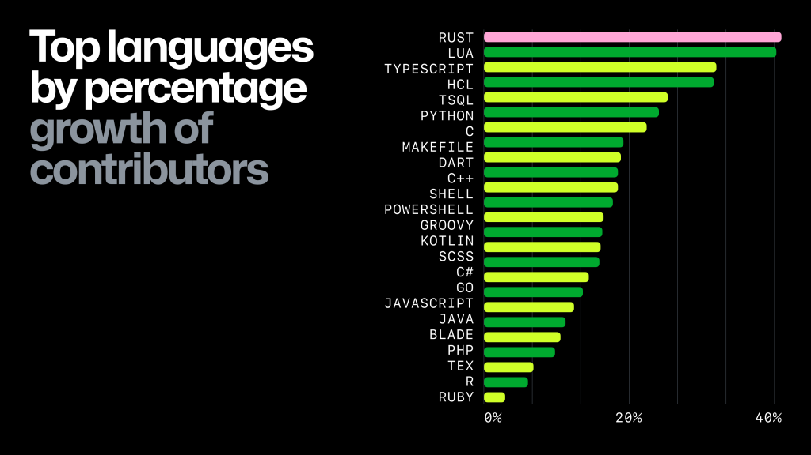

## Who is this for?
Be quiet or I will repalce you with one very small shells cript.


“Inside every large program is a small program struggling to get out.”
― Tony Hoare

Every block of stone has a statue inside it and it is the task of the sculptor to discover it.
-- Michelangelo


This code is for explorers. That is to say, the analysts building quick software tools to prod at some
problem in order to gain as much insight as possible in the shortest time.

If you not an explorer, there are many other palces to read  up on production-level programming.
But here, I write to service those bold software explorers struggling to find and tame  complex concepts. 
Increasingly, cs students are forgetting abut how to explore.
Recently I asked a student to , package up some of our research scripts for distribution. They could not do
anything unless they used the heavyweight IDE they had learned in second year CS.
This is not recommended practice. 
The best  way to quickly get more code to more people is to avoid heavyweight infrastructures.

Hence this book. All the tips and tricks that are general to 100,000 AI and SE tasks. All in a few dozen lines of code.
One quirk of this book is how mcuch is packed into how little code. Our total soruce code is under 500 lines. Ao brief yet so powerful.


## Why Lua? Why Not?

In August 2024, ZDNet writer David Gewirtz [aggregated data from nine different rankings](https://www.zdnet.com/article/the-most-popular-programming-languages-in-2024-and-what-that-even-means/) to create the ZDNET Index of Programming Language Popularity. He used data from:

- PYPL
- Tiobe
- GitHub Usage 2023 Survey
- Stack Overflow Professional Developers user profiles
- Stack Overflow’s Learning to Code list
- Stack Overflow’s Other Coders list
- IEEE Spectrum index
- IEEE Jobs index
- IEEE Trending index

These lists consistently show a top 20 (or so) languages that dominate, while many others hover near zero. With so many languages to choose from, I picked Lua because it is simple to learn and appears in the majority of those top-20 lists.

Lua’s minimalist design and straightforward syntax make it easy for beginners to start coding quickly. [Liam Dodd](https://www.developernation.net/blog/language-communities-who-leads-the-way/#:~:text=Lua%20has%20shown%20massive%20growth,AR%2FVR%20picking%20it%20up) reported that Lua’s community added almost 1 million developers in the past year, growing from 1.4 million in Q1 2022 to 2.3 million in Q3 2023. This trend is mirrored in other reports:

- In 2022, [Lua was the fourth-fastest growing language on GitHub](https://octoverse.github.com/2022/top-programming-languages).
- In 2023, [it ranked second](https://github.blog/news-insights/research/the-state-of-open-source-and-ai/):



Lua’s core is extremely lightweight—the full reference interpreter is about 250 kB when compiled, making it adaptable to a wide range of applications. The language uses just 22 keywords:

```
and       break     do        else      elseif    end
false     for       function  goto      if        in
local     nil       not       or        repeat    return
then      true      until     while
```

Despite its simplicity, Lua is powerful—think "LISP without the brackets." It
supports procedural, object-oriented, functional, and data-driven programming,
as well as data description. Lua’s procedural syntax is combined with powerful
constructs based on associative arrays and extensible semantics. It is
dynamically typed, runs byte code on a register-based virtual machine, and has
automatic memory management with incremental garbage collection, making it ideal
for configuration, scripting, and rapid prototyping.


 
